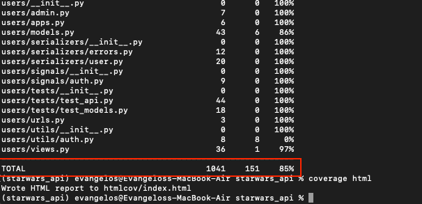

# Star Wars API

A Django REST Framework application that fetches, stores, and serves Star Wars data from the [Star Wars API (SWAPI)](https://swapi.dev/). This project provides REST endpoints for Films, Characters, and Starships with pagination, search functionality, and comprehensive error handling.

## Table of Contents

- [Description](#description)
- [Features](#features)
- [Prerequisites](#prerequisites)
- [Installation & Setup](#installation--setup)
- [Running the Application](#running-the-application)
- [Testing](#testing)
- [Docker Development](#docker-development)
- [Development Tools](#development-tools)
- [API Documentation](#api-documentation)
- [Project Structure](#project-structure)
- [Troubleshooting](#troubleshooting)
- [Contributing](#contributing)
- [License](#license)
- [Next Steps](#next-steps)

## Description

This application:
- Fetches data from the external SWAPI (swapi.dev) and stores it locally
- Provides REST API endpoints for Films, Characters, and Starships
- Supports pagination and search functionality
- Includes custom error handling and logging
- Features comprehensive unit tests with coverage reporting
- Uses Django REST Framework for API implementation
- Supports both SQLite (development) and PostgreSQL (production) databases

## Features

- **Data Ingestion**: Bulk import of Films, Characters, and Starships from SWAPI
- **REST API**: Clean, paginated endpoints with search capabilities
- **Error Handling**: Custom exceptions with consistent error responses
- **Testing**: Comprehensive unit tests with coverage reports
- **Code Quality**: Pre-commit hooks with linting and formatting
- **Documentation**: Auto-generated API documentation with drf-spectacular
- **Docker Support**: Containerized development environment

## Prerequisites

Before you begin, ensure you have the following installed:

- **Python 3.12** or higher
- **pip** (Python package installer)
- **Git**
- **PostgreSQL** (optional - SQLite is used by default)
- **Docker & Docker Compose** (optional - for containerized development)

## Installation & Setup

### 1. Clone the Repository

```bash
git clone <your-repository-url>
cd starwars_api
```

### 2. Create Virtual Environment

```bash
# Create virtual environment
python -m venv venv

# Activate virtual environment
# On macOS/Linux:
source venv/bin/activate

# On Windows:
venv\Scripts\activate
```

### 3. Install Dependencies

```bash
pip install -r requirements.txt
```

### 4. Environment Configuration (Optional)

Create a `.env` file in the project root for custom configuration:

```env
# Database (optional - defaults to SQLite)
POSTGRES_NAME=starwars_db
POSTGRES_USER=postgres
POSTGRES_PASSWORD=your_password
POSTGRES_HOST=localhost
POSTGRES_PORT=5432

# Django Settings
DEBUG=True
SECRET_KEY=your-secret-key-here
```

### 5. Database Setup

```bash
# Run database migrations
python manage.py migrate

# Create a superuser (optional)
python manage.py createsuperuser
```

### 6. Import SWAPI Data

```bash
# Fetch and store data from SWAPI
python manage.py fetch_swapi
```

This command will:
- Fetch all films from SWAPI
- Fetch all starships from SWAPI
- Fetch all characters from SWAPI
- Store the data in your local database with proper relationships

## Running the Application

### Development Server

```bash
python manage.py runserver
```

The API will be available at: `http://localhost:8000/api/`

### Available Endpoints

| Endpoint                    | Method | Description         | Query Parameters                                         | Authentication |
|-----------------------------|--------|---------------------|----------------------------------------------------------|----------------|
| `/api/starwars/films/`      | GET    | List all films      | `?page=1&search=<term>`                                  | No             |
| `/api/starwars/characters/` | GET    | List all characters | `?page=1&search=<term>`                                  | No             |
| `/api/starwars/starships/`  | GET    | List all starships  | `?page=1&search=<term>`                                  | No             |
| `/api/votes/`               | POST   | Create a vote       | `film_id`, `character_id`, `starship_id`                 | Yes            |
| `/api/users/register/`      | POST   | Register a user     | `first_name`,`last_name`,`username`, `password`, `email` | No             |
| `/api/users/login/`         | POST   | User login          | `username`, `password`                                   | No             |

### Example API Calls

```bash
# Get all films (paginated)
curl http://localhost:8000/api/films/

# Search for characters containing "Luke"
curl http://localhost:8000/api/characters/?search=Luke

# Get page 2 of starships
curl http://localhost:8000/api/starships/?page=2
```

### Response Format

All endpoints return data in the following format:

```json
{
  "films": [
    {
      "id": 1,
      "title": "A New Hope",
      "episode_id": 4,
      "opening_crawl": "It is a period of civil war...",
      "director": "George Lucas",
      "producer": "Gary Kurtz, Rick McCallum",
      "release_date": "1977-05-25",
      "characters": [
        "/api/starwars/characters/1/",
        "/api/starwars/characters/2/"
      ],
      "starships": [
        "/api/starwars/starships/1/"
      ]
    }
  ],
  "pagination": {
    "total_pages": 1,
    "current_page": 1,
    "total_items": 6
  }
}
```

## Testing

### Run All Tests

```bash
python manage.py test
```

### Run Specific Test Modules

```bash
# Test only models
python manage.py test api.tests.test_models

# Test with verbose output
python manage.py test --verbosity=2
```

### Test Coverage

```bash
# Run tests with coverage
coverage run --source='.' manage.py test

# Generate HTML coverage report
coverage html

# View coverage report
open htmlcov/index.html  # macOS
# or
xdg-open htmlcov/index.html  # Linux
```

### Coverage Report



## Docker Development

### Using Docker Compose

```bash
# Build and start all services
docker-compose up --build

# Run in background
docker-compose up -d

# Stop services
docker-compose down
```

### Docker Commands

```bash
# Run migrations in container
docker-compose exec swapi python manage.py migrate

# Import SWAPI data in container
docker-compose exec swapi python manage.py fetch_swapi

# Run tests in container
docker-compose exec swapi python manage.py test

# Access Django shell in container
docker-compose exec swapi python manage.py shell
```

## Development Tools

### Pre-commit Hooks

Set up code quality checks:

```bash
# Install pre-commit hooks
pre-commit install

# Run hooks manually
pre-commit run --all-files
```

### Management Commands

```bash
# Fetch SWAPI data
python manage.py fetch_swapi

# Create superuser
python manage.py createsuperuser

# Check for issues
python manage.py check

# Run development server
python manage.py runserver 0.0.0.0:8000
```

## API Documentation

### Swagger/OpenAPI

If `drf-spectacular` is configured, access interactive API documentation:

- **Swagger UI**: `http://localhost:8000/api/schema/swagger-ui/`
- **ReDoc**: `http://localhost:8000/api/schema/redoc/`
- **OpenAPI Schema**: `http://localhost:8000/api/schema/`

### Django Admin

Access the Django admin interface:

- **URL**: `http://localhost:8000/admin/`
- **Login**: Use superuser credentials

## Project Structure

```
starwars_api/
├── api/                    # Main Django app
│   ├── management/         # Custom management commands
│   │   └── commands/
│   │       └── fetch_swapi.py
│   ├── tests/             # Unit tests
│   ├── models.py          # Data models (Film, Character, Starship, Vote)
│   ├── views.py           # API views
│   ├── serializers.py     # DRF serializers
│   ├── urls.py            # URL patterns
│   ├── swapi_service.py   # SWAPI data ingestion service
│   └── exceptions.py      # Custom exceptions
├── clients/               # External API clients
├── users/                 # Custom user model
├── starwars_api/         # Django project settings
├── requirements.txt      # Python dependencies
├── docker-compose.yml    # Docker configuration
└── manage.py             # Django management script
```

## Troubleshooting

### Common Issues

1. **Database connection errors**: Make sure PostgreSQL is running if using PostgreSQL or ensure SQLite permissions are correct.

2. **SWAPI import fails**: Check your internet connection and SWAPI availability at https://swapi.dev/

3. **Missing dependencies**: Ensure you've activated your virtual environment and installed all requirements.

4. **Port already in use**: Use a different port: `python manage.py runserver 8001`

### Useful Commands

```bash
# Check Django configuration
python manage.py check

# Show migrations status
python manage.py showmigrations

# Create new migrations
python manage.py makemigrations

# Reset database (development only)
python manage.py flush
```

## Contributing

1. Fork the repository
2. Create a feature branch (`git checkout -b feature/amazing-feature`)
3. Install pre-commit hooks (`pre-commit install`)
4. Make your changes and ensure tests pass
5. Commit your changes (`git commit -m 'Add amazing feature'`)
6. Push to the branch (`git push origin feature/amazing-feature`)
7. Open a Pull Request

## License

This project is licensed under the MIT License.

---

## Next Steps
A lot of time and effort has gone into building this Star Wars API already leaving things out, so for that reason in this section we will describe the next steps to take this project further.

Here are some suggested next steps to further enhance the project:

- **Add more tests for edge cases and for Database Service.**
- **Increase test coverage by adding more tests for serializers, views, and models, especially for error handling.**
- **Improve error handling for external API failures.**
- **Refactor code for better readability and maintainability (e.g., break views and tests into separate files).**
- **Mixin or BaseSWAPIView for common functionality across views (like pagination and search).**
- **Implement caching for SWAPI data to reduce API calls and improve performance.**
- **Periodic tasks to update data from SWAPI.**
- **Use fixture JSON files for testing to avoid duplicating test data.**
- **Implement CP pipelines for CI/CD.**


**May the Force be with you!** 🌟
